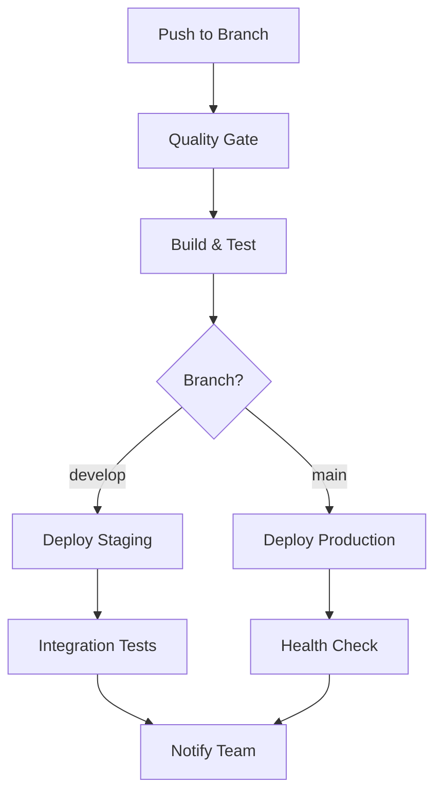

# 🚀 CI/CD ENTERPRISE PIPELINE

## 📋 **PIPELINE OVERVIEW**



## 🏗️ **GITHUB ACTIONS WORKFLOWS**

### **Main CI/CD Pipeline**
```yaml
# .github/workflows/ci-cd.yml
name: CI/CD Pipeline

on:
  push:
    branches: [main, develop]
  pull_request:
    branches: [main]

env:
  NODE_VERSION: '20'
  PNPM_VERSION: '8'

jobs:
  quality-gate:
    name: Quality Gate
    runs-on: ubuntu-latest
    timeout-minutes: 15
    
    steps:
      - name: Checkout code
        uses: actions/checkout@v4
        with:
          fetch-depth: 0

      - name: Setup pnpm
        uses: pnpm/action-setup@v2
        with:
          version: ${{ env.PNPM_VERSION }}

      - name: Setup Node.js
        uses: actions/setup-node@v4
        with:
          node-version: ${{ env.NODE_VERSION }}
          cache: 'pnpm'

      - name: Install dependencies
        run: pnpm install --frozen-lockfile

      - name: TypeScript check
        run: pnpm type-check

      - name: Lint code
        run: pnpm lint

      - name: Run unit tests
        run: pnpm test:unit --coverage

      - name: Run integration tests
        run: pnpm test:integration

      - name: Security audit
        run: pnpm audit --audit-level moderate

      - name: Build application
        run: pnpm build

      - name: Bundle analysis
        run: pnpm analyze

      - name: Upload coverage to Codecov
        uses: codecov/codecov-action@v3
        with:
          token: ${{ secrets.CODECOV_TOKEN }}
          fail_ci_if_error: true

      - name: Cache build artifacts
        uses: actions/cache@v3
        with:
          path: dist
          key: build-${{ github.sha }}

  e2e-tests:
    name: E2E Tests
    runs-on: ubuntu-latest
    needs: quality-gate
    timeout-minutes: 30

    steps:
      - name: Checkout code
        uses: actions/checkout@v4

      - name: Setup pnpm
        uses: pnpm/action-setup@v2
        with:
          version: ${{ env.PNPM_VERSION }}

      - name: Setup Node.js
        uses: actions/setup-node@v4
        with:
          node-version: ${{ env.NODE_VERSION }}
          cache: 'pnpm'

      - name: Install dependencies
        run: pnpm install --frozen-lockfile

      - name: Install Playwright browsers
        run: pnpm exec playwright install --with-deps

      - name: Start development server
        run: pnpm dev &
        env:
          CI: true

      - name: Wait for server
        run: npx wait-on http://localhost:5173

      - name: Run E2E tests
        run: pnpm test:e2e

      - name: Upload E2E artifacts
        uses: actions/upload-artifact@v3
        if: failure()
        with:
          name: e2e-results
          path: test-results/

  security-scan:
    name: Security Scan
    runs-on: ubuntu-latest
    needs: quality-gate

    steps:
      - name: Checkout code
        uses: actions/checkout@v4

      - name: Run CodeQL Analysis
        uses: github/codeql-action/init@v2
        with:
          languages: typescript, javascript

      - name: Build for analysis
        run: |
          npm ci
          npm run build

      - name: Perform CodeQL Analysis
        uses: github/codeql-action/analyze@v2

      - name: Run Snyk security scan
        uses: snyk/actions/node@master
        env:
          SNYK_TOKEN: ${{ secrets.SNYK_TOKEN }}
        with:
          args: --severity-threshold=medium

  deploy-staging:
    name: Deploy to Staging
    runs-on: ubuntu-latest
    needs: [quality-gate, e2e-tests, security-scan]
    if: github.ref == 'refs/heads/develop'
    environment: staging

    steps:
      - name: Checkout code
        uses: actions/checkout@v4

      - name: Restore build cache
        uses: actions/cache@v3
        with:
          path: dist
          key: build-${{ github.sha }}

      - name: Deploy to Vercel Staging
        uses: amondnet/vercel-action@v25
        with:
          vercel-token: ${{ secrets.VERCEL_TOKEN }}
          vercel-org-id: ${{ secrets.VERCEL_ORG_ID }}
          vercel-project-id: ${{ secrets.VERCEL_PROJECT_ID }}
          scope: staging

      - name: Run staging health checks
        run: |
          curl -f https://staging.vaga-agil.com/health || exit 1

      - name: Notify team
        uses: 8398a7/action-slack@v3
        with:
          status: ${{ job.status }}
          webhook_url: ${{ secrets.SLACK_WEBHOOK }}
          text: "Staging deployment completed: https://staging.vaga-agil.com"

  deploy-production:
    name: Deploy to Production
    runs-on: ubuntu-latest
    needs: [quality-gate, e2e-tests, security-scan]
    if: github.ref == 'refs/heads/main'
    environment: production

    steps:
      - name: Checkout code
        uses: actions/checkout@v4

      - name: Restore build cache
        uses: actions/cache@v3
        with:
          path: dist
          key: build-${{ github.sha }}

      - name: Deploy to Vercel Production
        uses: amondnet/vercel-action@v25
        with:
          vercel-token: ${{ secrets.VERCEL_TOKEN }}
          vercel-org-id: ${{ secrets.VERCEL_ORG_ID }}
          vercel-project-id: ${{ secrets.VERCEL_PROJECT_ID }}
          vercel-args: '--prod'

      - name: Run production health checks
        run: |
          curl -f https://vaga-agil.com/health || exit 1
          curl -f https://vaga-agil.com/api/status || exit 1

      - name: Create GitHub release
        uses: actions/create-release@v1
        env:
          GITHUB_TOKEN: ${{ secrets.GITHUB_TOKEN }}
        with:
          tag_name: v${{ github.run_number }}
          release_name: Release v${{ github.run_number }}
          draft: false
          prerelease: false

      - name: Notify team
        uses: 8398a7/action-slack@v3
        with:
          status: ${{ job.status }}
          webhook_url: ${{ secrets.SLACK_WEBHOOK }}
          text: "Production deployment completed: https://vaga-agil.com"
```

### **Semantic Release Workflow**
```yaml
# .github/workflows/release.yml
name: Release

on:
  push:
    branches: [main]

jobs:
  release:
    name: Semantic Release
    runs-on: ubuntu-latest
    if: github.repository == 'company/vaga-agil-driver'

    steps:
      - name: Checkout
        uses: actions/checkout@v4
        with:
          fetch-depth: 0
          persist-credentials: false

      - name: Setup Node.js
        uses: actions/setup-node@v4
        with:
          node-version: '20'

      - name: Install dependencies
        run: npm ci

      - name: Release
        env:
          GITHUB_TOKEN: ${{ secrets.GITHUB_TOKEN }}
          NPM_TOKEN: ${{ secrets.NPM_TOKEN }}
        run: npx semantic-release
```

### **Performance Monitoring**
```yaml
# .github/workflows/performance.yml
name: Performance Monitoring

on:
  schedule:
    - cron: '0 */6 * * *'  # Every 6 hours
  workflow_dispatch:

jobs:
  lighthouse:
    name: Lighthouse Performance Audit
    runs-on: ubuntu-latest

    steps:
      - name: Lighthouse CI
        uses: treosh/lighthouse-ci-action@v9
        with:
          configPath: '.lighthouserc.json'
          uploadArtifacts: true
          temporaryPublicStorage: true
        env:
          LHCI_GITHUB_APP_TOKEN: ${{ secrets.LHCI_GITHUB_APP_TOKEN }}

  bundle-analysis:
    name: Bundle Size Analysis
    runs-on: ubuntu-latest

    steps:
      - name: Checkout
        uses: actions/checkout@v4

      - name: Setup Node.js
        uses: actions/setup-node@v4
        with:
          node-version: '20'
          cache: 'npm'

      - name: Install dependencies
        run: npm ci

      - name: Build and analyze
        run: npm run analyze

      - name: Upload bundle analysis
        uses: actions/upload-artifact@v3
        with:
          name: bundle-analysis
          path: dist/stats.html
```

## 📊 **CONFIGURATION FILES**

### **Package.json Scripts**
```json
{
  "scripts": {
    "dev": "vite",
    "build": "tsc && vite build",
    "preview": "vite preview",
    "lint": "eslint . --ext ts,tsx --report-unused-disable-directives --max-warnings 0",
    "lint:fix": "eslint . --ext ts,tsx --fix",
    "type-check": "tsc --noEmit",
    "test:unit": "vitest run",
    "test:unit:watch": "vitest",
    "test:integration": "vitest run --config vitest.integration.config.ts",
    "test:e2e": "playwright test",
    "test:e2e:ui": "playwright test --ui",
    "test:ci": "npm run test:unit && npm run test:integration",
    "analyze": "vite-bundle-analyzer dist/stats.json",
    "coverage": "vitest run --coverage",
    "build:staging": "NODE_ENV=staging npm run build",
    "build:production": "NODE_ENV=production npm run build",
    "health-check": "node scripts/health-check.js"
  }
}
```

### **Lighthouse CI Configuration**
```json
// .lighthouserc.json
{
  "ci": {
    "collect": {
      "url": [
        "https://vaga-agil.com",
        "https://vaga-agil.com/admin",
        "https://vaga-agil.com/vaga/1"
      ],
      "startServerCommand": "npm run preview",
      "numberOfRuns": 3
    },
    "assert": {
      "assertions": {
        "categories:performance": ["warn", {"minScore": 0.85}],
        "categories:accessibility": ["error", {"minScore": 0.95}],
        "categories:best-practices": ["error", {"minScore": 0.90}],
        "categories:seo": ["warn", {"minScore": 0.80}]
      }
    },
    "upload": {
      "target": "temporary-public-storage"
    }
  }
}
```

### **Semantic Release Configuration**
```json
// .releaserc.json
{
  "branches": ["main"],
  "plugins": [
    "@semantic-release/commit-analyzer",
    "@semantic-release/release-notes-generator",
    "@semantic-release/changelog",
    [
      "@semantic-release/npm",
      {
        "npmPublish": false
      }
    ],
    [
      "@semantic-release/git",
      {
        "assets": ["CHANGELOG.md", "package.json", "package-lock.json"],
        "message": "chore(release): ${nextRelease.version} [skip ci]\n\n${nextRelease.notes}"
      }
    ],
    "@semantic-release/github"
  ]
}
```

## 🔍 **MONITORING & ALERTING**

### **Health Check Script**
```javascript
// scripts/health-check.js
const https = require('https');

const checkEndpoint = (url) => {
  return new Promise((resolve, reject) => {
    const req = https.get(url, (res) => {
      if (res.statusCode === 200) {
        resolve(`✅ ${url} is healthy`);
      } else {
        reject(new Error(`❌ ${url} returned ${res.statusCode}`));
      }
    });

    req.on('error', (error) => {
      reject(new Error(`❌ ${url} failed: ${error.message}`));
    });

    req.setTimeout(5000, () => {
      req.destroy();
      reject(new Error(`❌ ${url} timeout`));
    });
  });
};

const healthChecks = [
  'https://vaga-agil.com/health',
  'https://vaga-agil.com/api/status',
  'https://staging.vaga-agil.com/health'
];

Promise.allSettled(healthChecks.map(checkEndpoint))
  .then(results => {
    results.forEach((result, index) => {
      if (result.status === 'fulfilled') {
        console.log(result.value);
      } else {
        console.error(result.reason.message);
        process.exit(1);
      }
    });
  });
```

### **Monitoring Integration**
```typescript
// src/monitoring/CIMetrics.ts
export class CIMetrics {
  static reportDeployment(environment: string, version: string): void {
    // Datadog deployment tracking
    fetch('https://api.datadoghq.com/api/v1/events', {
      method: 'POST',
      headers: {
        'DD-API-KEY': process.env.DATADOG_API_KEY!,
        'Content-Type': 'application/json'
      },
      body: JSON.stringify({
        title: `Deployment to ${environment}`,
        text: `Version ${version} deployed to ${environment}`,
        tags: [`environment:${environment}`, `version:${version}`],
        alert_type: 'info'
      })
    });
  }

  static reportBuildMetrics(metrics: BuildMetrics): void {
    // Slack notification for build metrics
    const message = {
      text: `Build completed in ${metrics.duration}ms`,
      attachments: [
        {
          color: metrics.success ? 'good' : 'danger',
          fields: [
            { title: 'Bundle Size', value: metrics.bundleSize, short: true },
            { title: 'Test Coverage', value: `${metrics.coverage}%`, short: true },
            { title: 'Performance Score', value: metrics.lighthouse, short: true }
          ]
        }
      ]
    };

    fetch(process.env.SLACK_WEBHOOK_URL!, {
      method: 'POST',
      headers: { 'Content-Type': 'application/json' },
      body: JSON.stringify(message)
    });
  }
}
```

## 🚀 **DEPLOYMENT STRATEGIES**

### **Blue-Green Deployment**
```yaml
# .github/workflows/blue-green-deploy.yml
name: Blue-Green Deployment

on:
  workflow_dispatch:
    inputs:
      environment:
        description: 'Target environment'
        required: true
        default: 'production'
        type: choice
        options:
        - production
        - staging

jobs:
  deploy:
    runs-on: ubuntu-latest
    environment: ${{ github.event.inputs.environment }}

    steps:
      - name: Deploy to Blue slot
        run: |
          # Deploy new version to blue slot
          vercel --prod --env SLOT=blue

      - name: Health check Blue slot
        run: |
          curl -f https://blue.vaga-agil.com/health

      - name: Switch traffic to Blue
        run: |
          # Switch DNS/load balancer to blue slot
          # Keep green slot as backup

      - name: Monitor metrics
        run: |
          # Monitor error rates and performance
          sleep 300  # 5 minutes

      - name: Cleanup Green slot
        run: |
          # Remove old green deployment
          echo "Deployment successful, cleaning up old version"
```

### **Canary Deployment**
```yaml
# .github/workflows/canary-deploy.yml
name: Canary Deployment

on:
  workflow_dispatch:
    inputs:
      traffic_percentage:
        description: 'Percentage of traffic to route to canary'
        required: true
        default: '10'

jobs:
  canary:
    runs-on: ubuntu-latest

    steps:
      - name: Deploy Canary
        run: |
          # Deploy canary version
          vercel --prod --env CANARY=true

      - name: Route traffic
        run: |
          # Route X% traffic to canary
          # Monitor metrics for 30 minutes

      - name: Evaluate metrics
        run: |
          # Check error rates, response times
          # Auto-rollback if metrics degrade
```

## 📋 **ENVIRONMENT SETUP**

### **GitHub Secrets Required**
```bash
# Deployment
VERCEL_TOKEN
VERCEL_ORG_ID
VERCEL_PROJECT_ID

# Security
SNYK_TOKEN
CODECOV_TOKEN

# Notifications
SLACK_WEBHOOK
LHCI_GITHUB_APP_TOKEN

# Monitoring
DATADOG_API_KEY
SENTRY_DSN

# Database
SUPABASE_SERVICE_KEY
DATABASE_URL
```

### **Branch Protection Rules**
```yaml
# Branch protection for main
required_status_checks:
  strict: true
  contexts:
    - "quality-gate"
    - "e2e-tests"
    - "security-scan"

enforce_admins: true
required_pull_request_reviews:
  required_approving_review_count: 2
  dismiss_stale_reviews: true
  require_code_owner_reviews: true

restrictions:
  users: []
  teams: ["frontend-team", "devops-team"]
```

Este pipeline CI/CD fornece uma base sólida para deploy enterprise com qualidade, segurança e monitoramento automatizados!
