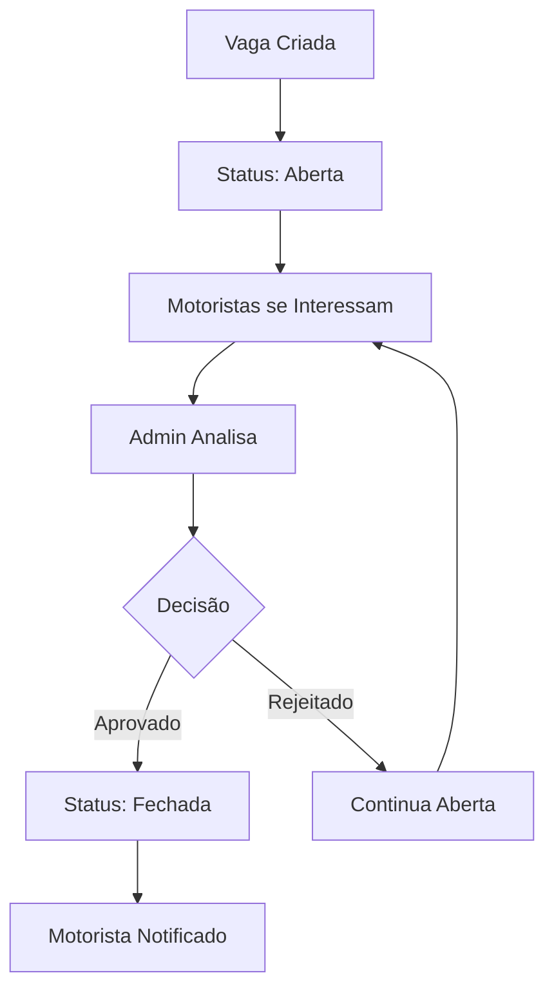

# 🔧 Como Funciona o Sistema

## 📊 Fluxo Principal do Sistema

### 1. 🏢 Administrador
1. **Login** → Acessa painel administrativo
2. **Importa planilha** → Carrega dados de motoristas
3. **Cria vagas** → Define vagas disponíveis
4. **Monitora** → Acompanha solicitações em tempo real
5. **Aprova/Rejeita** → Toma decisões sobre as solicitações

### 2. 🚛 Motorista
1. **Login** → Acessa painel do motorista
2. **Visualiza vagas** → Vê vagas disponíveis
3. **Demonstra interesse** → Solicita vaga
4. **Aguarda aprovação** → Acompanha status
5. **Recebe notificação** → Confirmação da decisão

## 🗄️ Estrutura do Banco de Dados

### Tabelas Principais

#### `vagas`
- `id` - Identificador único
- `gaiola` - Número da gaiola
- `destino` - Destino da viagem
- `status` - Status da vaga (aberta/fechada)
- `created_at` - Data de criação

#### `motoristas`
- `id` - Identificador único
- `nome` - Nome do motorista
- `telefone` - Telefone de contato
- `placa` - Placa do veículo
- `created_at` - Data de cadastro

#### `solicitacoes`
- `id` - Identificador único
- `vaga_id` - ID da vaga
- `motorista_id` - ID do motorista
- `status` - Status (pendente/aprovado/rejeitado)
- `created_at` - Data da solicitação

## 🔄 Estados do Sistema

### Status de Vaga
- **🟢 Aberta** - Aceita solicitações
- **🟡 Pendente** - Com solicitações aguardando
- **🔴 Fechada** - Vaga preenchida

### Status de Solicitação
- **⏳ Pendente** - Aguardando análise
- **✅ Aprovada** - Motorista selecionado
- **❌ Rejeitada** - Solicitação negada

## 📡 Funcionalidades em Tempo Real

### Supabase Realtime
- **Conexão WebSocket** → Atualizações instantâneas
- **Sync automático** → Dados sempre atualizados
- **Notificações** → Alertas em tempo real

### Hooks de Sincronização
- `useRealtimeData` → Dados em tempo real
- `useVagaData` → Estado das vagas
- `useDriverData` → Dados dos motoristas

## 🎯 Componentes Principais

### 🏢 AdminPanel (Painel Administrativo)
- **Localização**: `src/pages/PainelAdmin.tsx`
- **Função**: Controle geral do sistema
- **Recursos**: Import/export, aprovações, relatórios

### 🚛 DriverPanel (Painel do Motorista)
- **Localização**: `src/pages/PainelMotorista.tsx`
- **Função**: Interface do motorista
- **Recursos**: Visualizar vagas, solicitar interesse

### 📊 VagaPanel (Painel de Vagas)
- **Localização**: `src/pages/PainelVagas.tsx`
- **Função**: Detalhes específicos da vaga
- **Recursos**: Lista de interessados, aprovações

## 🔄 Ciclo de Vida de uma Vaga

## 📝 Logs e Monitoramento

### Sistema de Logs
- **Localização**: `logs/errors.log`
- **Formato**: JSON com timestamp
- **Níveis**: ERROR, WARN, INFO, DEBUG

### Métricas Acompanhadas
- Tempo de resposta das operações
- Erros de conexão com banco
- Taxa de aprovação de solicitações
- Uso de memória e performance
